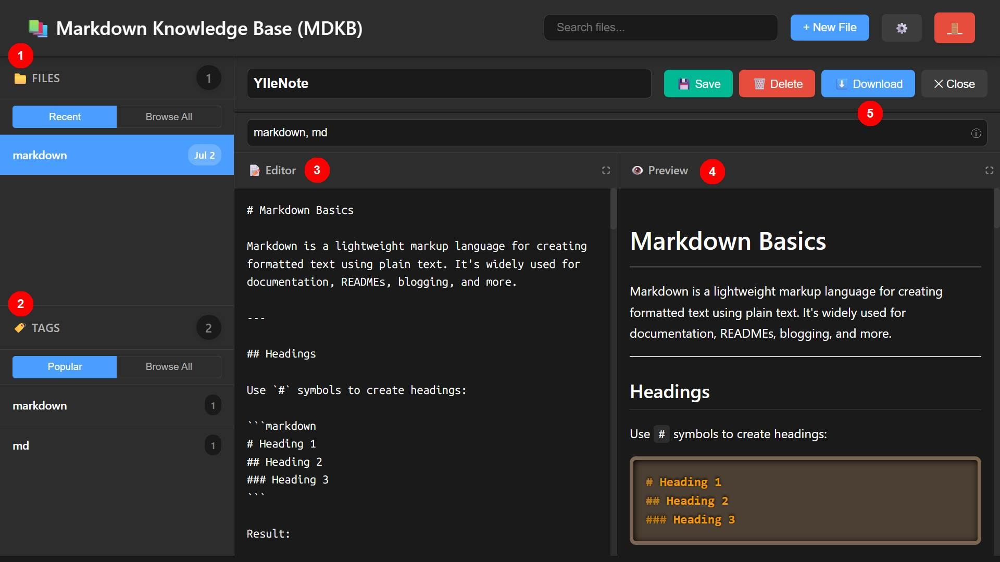

# Installation Guide

# Markdown Knowledge Base (MDKB)

A modern, self-hosted web application that puts you in complete control of your documentation and notes. Built with PHP and featuring a clean, responsive interface, it allows you to create, edit, and organize Markdown files with powerful tagging and search capabilities - all while keeping your data private and secure.

## Why Self-Host Your Knowledge Base?

### 🔐 **Complete Data Control**
Unlike cloud-based solutions, your sensitive notes and documentation never leave your infrastructure. Perfect for:
- **Confidential Business Information**: Trade secrets, strategies, internal processes
- **Personal Privacy**: Private thoughts, financial notes, health records  
- **Compliance Requirements**: GDPR, HIPAA, SOX, and other regulatory needs
- **Corporate Security**: No third-party access to your intellectual property

### 💸 **Significant Cost Savings**
Stop paying monthly fees for basic note-taking functionality:
- **Commercial Solutions**: Range from medium to high monthly costs per user
- **Enterprise Platforms**: High monthly costs with per-seat pricing
- **Team Collaboration Tools**: Medium to high monthly costs for team features
- **MDKB**: Free (Open Source) forever + your existing server costs

### 🛡️ **Enterprise-Grade Without Enterprise Costs**
- **No Vendor Lock-in**: Export your data anytime in standard Markdown
- **Unlimited Users**: No per-seat pricing or user limits
- **Full Customization**: Modify the code to fit your exact needs
- **Air-Gapped Deployment**: Run completely offline if required

## Perfect For Organizations & Individuals Who Value:

✅ **Privacy-First Approach**: Medical practices, legal firms, financial advisors  
✅ **Budget-Conscious Teams**: Startups, non-profits, educational institutions  
✅ **Technical Control**: Development teams, IT departments, system administrators  
✅ **Compliance Requirements**: Government agencies, healthcare, finance  
✅ **Long-term Reliability**: No risk of service shutdown or price increases

## System Requirements

**Minimal Requirements** (Perfect for personal use):
- **Web Server**: Apache, Nginx, or PHP built-in server
- **PHP**: Version 7.4 or higher (PHP 8.x recommended)
- **Storage**: 50MB for application + your content size
- **Memory**: 64MB PHP memory limit (standard shared hosting)

**Recommended Production Setup**:
- **Server**: VPS with 1GB RAM, 10GB storage
- **PHP**: 8.1+ with extensions: `json`, `mbstring`, `fileinfo`
- **Web Server**: Nginx or Apache with SSL certificate
- **Backup**: Automated daily backups of content directory

**Deployment Options**:
- 🏠 **Home Server**: Raspberry Pi, NAS, or spare computer
- ☁️ **Cloud VPS**: DigitalOcean, Linode, Vultr (low monthly cost)
- 🌐 **Shared Hosting**: Most PHP hosting providers work
- 🐳 **Docker**: Containerized deployment for consistency

## Quick Installation Methods

### Method 1: One-Command Setup (Recommended for Testing)

```bash
# Download and run instantly
curl -sL https://raw.githubusercontent.com/yllemo/Markdown-Knowledge-Base/main/install.sh | bash
```

### Method 2: Manual Installation (Recommended for Production)

```bash
# Clone the repository
git clone https://github.com/yllemo/Markdown-Knowledge-Base.git
cd Markdown-Knowledge-Base

# Set permissions (Linux/Mac)
chmod 755 content/
chmod 644 config.php

# Start development server
php -S localhost:8000
```

### Method 3: Docker Deployment

```bash
# Quick Docker setup
docker run -d \
  --name mdkb \
  -p 8000:80 \
  -v ./content:/var/www/html/content \
  -v ./config:/var/www/html/config \
  php:8.1-apache

# Or use docker-compose
curl -O https://raw.githubusercontent.com/yllemo/Markdown-Knowledge-Base/main/docker-compose.yml
docker-compose up -d
```

## Key Features




### 📁 **1. Advanced File Management**
- **Intuitive Interface**: Create, edit, and delete Markdown files through a web interface
- **Smart Organization**: Automatic file management with modification timestamps and file size tracking
- **Secure Storage**: Dedicated content directory with proper access controls and backup support
- **Bulk Operations**: Import existing Markdown files or export entire collections

### 🏷️ **2. Intelligent Tagging System**
- **Flexible Categorization**: Organize content with unlimited tags for easy categorization
- **Quick Navigation**: Browse and filter files by tags with instant search results
- **Cross-Reference Search**: Find related content across your entire knowledge base
- **Tag Analytics**: See most-used tags and content relationships

### ✏️ **3. Professional Markdown Editor**
- **Syntax Highlighting**: Built-in editor with Markdown syntax highlighting and auto-save
- **Live Preview**: Real-time rendering as you type with synchronized scrolling
- **Customizable Interface**: Adjustable font size, themes, and editor preferences
- **Keyboard Shortcuts**: Efficient editing with standard Markdown shortcuts

### 👁️ **4. Real-Time Preview System**
- **Side-by-Side View**: Live preview of rendered Markdown content alongside editor
- **Responsive Rendering**: Perfect display on desktop, tablet, and mobile devices
- **Focus Modes**: Fullscreen editing or preview for distraction-free writing
- **Export Options**: Generate clean HTML or PDF from your Markdown content

### 📥 **5. Secure Download & Export**
- **Individual File Export**: Download any file in original Markdown format
- **Batch Export**: Export multiple files or entire tag collections
- **Authentication Required**: Secure download API with proper access control
- **Format Preservation**: Maintains original formatting, links, and metadata

### 🔐 **Additional Enterprise Features**
- **Secure Authentication**: Cookie-based login system with configurable session timeouts
- **Responsive Design**: Perfect experience on desktop, tablet, and mobile devices
- **Theme Support**: Dark and light themes with customizable interface options
- **File Upload Support**: Attach images and documents with configurable size/type restrictions
- **Search Engine**: Fast full-text search across all your content and tags
- **Backup Integration**: Easy backup and restore of your entire knowledge base

## Production Installation Guide

### Step 1: Server Preparation

**For Ubuntu/Debian:**
```bash
# Update system
sudo apt update && sudo apt upgrade -y

# Install required packages
sudo apt install -y nginx php8.1-fpm php8.1-cli php8.1-common php8.1-json php8.1-mbstring

# Configure Nginx (example)
sudo nano /etc/nginx/sites-available/mdkb
```

**For CentOS/RHEL:**
```bash
# Install PHP and web server
sudo yum install -y nginx php php-fpm php-json php-mbstring

# Configure and start services
sudo systemctl enable nginx php-fpm
sudo systemctl start nginx php-fpm
```

### Step 2: Application Deployment

```bash
# Create application directory
sudo mkdir -p /var/www/mdkb
cd /var/www/mdkb

# Clone and configure
sudo git clone https://github.com/yllemo/Markdown-Knowledge-Base.git .
sudo chown -R www-data:www-data /var/www/mdkb
sudo chmod 755 content/

# Create custom configuration
sudo cp config.php config.custom.php
sudo nano config.custom.php
```

### Step 3: Web Server Configuration

**Nginx Configuration Example:**
```nginx
server {
    listen 80;
    server_name yourdomain.com;
    root /var/www/mdkb;
    index index.php;

    location / {
        try_files $uri $uri/ /index.php?$query_string;
    }

    location ~ \.php$ {
        fastcgi_pass unix:/var/run/php/php8.1-fpm.sock;
        fastcgi_index index.php;
        include fastcgi_params;
        fastcgi_param SCRIPT_FILENAME $document_root$fastcgi_script_name;
    }

    # Security headers
    add_header X-Frame-Options "SAMEORIGIN";
    add_header X-Content-Type-Options "nosniff";
}
```

### Step 4: SSL Certificate (Recommended)

```bash
# Using Let's Encrypt (free SSL)
sudo apt install certbot python3-certbot-nginx
sudo certbot --nginx -d yourdomain.com

# Or use Cloudflare, AWS Certificate Manager, etc.
```

## First Time Setup

### Quick Setup (2 minutes)

1. **Access Setup Wizard**
   - Navigate to: `https://yourdomain.com/setup.php`
   - Or visit your main URL - it will redirect automatically

2. **Configure Basic Settings**
   - **Site Title**: Give your knowledge base a name
   - **Admin Password**: Set a strong password (minimum 8 characters recommended)
   - **Theme Preference**: Choose dark or light mode
   - **Security Options**: Configure session timeout and login attempts

3. **Complete Installation**
   - Click "Complete Setup" to save configuration
   - System will create necessary directories and configuration files
   - You'll be redirected to the login page

4. **Start Using MDKB**
   - Log in with your configured password
   - Create your first Markdown document
   - Begin organizing with tags and folders

### Advanced Configuration Options

**Security Settings** (`config.custom.php`):
```php
// Custom password (override default)
$config['password'] = 'your-secure-password-here';

// Session timeout (in seconds)
$config['session_timeout'] = 3600; // 1 hour

// Maximum login attempts
$config['max_login_attempts'] = 5;

// Enable/disable registration
$config['allow_registration'] = false;
```

**Performance Tuning**:
```php
// File upload limits
$config['max_file_size'] = '10M';
$config['allowed_file_types'] = ['md', 'txt', 'jpg', 'png', 'pdf'];

// Search and indexing
$config['enable_full_text_search'] = true;
$config['search_results_limit'] = 50;

// Backup settings
$config['auto_backup'] = true;
$config['backup_retention_days'] = 30;
$config['backup_directory'] = '.backups';  // In root of MDKB installation
```

## Security Best Practices

### Essential Security Measures

**🔒 Authentication & Access Control:**
- Use strong, unique passwords (consider password managers)
- Enable two-factor authentication if implementing custom extensions
- Regularly rotate passwords, especially in team environments
- Implement IP whitelisting for sensitive deployments

**🌐 Network Security:**
- **Always use HTTPS** in production environments (free with Let's Encrypt)
- Configure proper firewall rules (only allow necessary ports)
- Use fail2ban or similar tools to prevent brute force attacks
- Consider VPN access for highly sensitive installations

**💾 Data Protection:**
- **Regular Backups**: Automate daily backups of the `content/` directory
- **File Permissions**: Set proper Unix permissions (755 for directories, 644 for files)
- **Database Security**: If extending with database features, use encrypted connections
- **Update Schedule**: Keep PHP, web server, and OS updated regularly

**🔍 Monitoring & Maintenance:**
- Monitor access logs for suspicious activity
- Set up disk space alerts for content growth
- Implement log rotation for web server logs
- Test backup restoration procedures regularly

### Backup Strategy

**Automated Backup Script Example:**
```bash
#!/bin/bash
# backup-mdkb.sh - Daily backup script

DATE=$(date +%Y%m%d)
SOURCE_DIR="/var/www/mdkb"
BACKUP_DIR="$SOURCE_DIR/.backups"  # In the root of MDKB installation

# Create backup directory
mkdir -p $BACKUP_DIR

# Backup content and configuration
tar -czf $BACKUP_DIR/mdkb-$DATE.tar.gz \
    $SOURCE_DIR/content/ \
    $SOURCE_DIR/config.custom.php

# Keep only last 30 days of backups
find $BACKUP_DIR -name "mdkb-*.tar.gz" -mtime +30 -delete

# Optional: Upload to cloud storage
# aws s3 cp $BACKUP_DIR/mdkb-$DATE.tar.gz s3://your-backup-bucket/
```

**Cloud Backup Options:**
- **AWS S3**: Automated, versioned, encrypted storage
- **Google Cloud Storage**: Cost-effective with lifecycle management
- **Dropbox/OneDrive**: Simple sync for small installations
- **rsync**: Sync to remote server or NAS device

## Troubleshooting Common Issues

### Permission Problems
```bash
# Fix file permissions
sudo chown -R www-data:www-data /var/www/mdkb
sudo chmod -R 755 /var/www/mdkb/content
sudo chmod 644 /var/www/mdkb/config.custom.php
```

### PHP Configuration Issues
```bash
# Check PHP version and modules
php -v
php -m | grep -E "(json|mbstring|fileinfo)"

# Increase memory limit if needed
echo "memory_limit = 256M" | sudo tee -a /etc/php/8.1/fpm/php.ini
sudo systemctl restart php8.1-fpm
```

### Web Server Problems
```bash
# Check Nginx status and configuration
sudo nginx -t
sudo systemctl status nginx
sudo tail -f /var/log/nginx/error.log
```

## Scaling & Performance

### For Growing Teams (10-50 users)
- **Server Specs**: 2-4 GB RAM, 2-4 CPU cores
- **Storage**: SSD recommended for better search performance
- **Caching**: Implement PHP OPcache for faster response times
- **Load Balancing**: Use Nginx as reverse proxy if needed

### For Large Organizations (50+ users)
- **High Availability**: Multiple server instances with shared storage
- **Database Backend**: Consider PostgreSQL/MySQL for advanced features
- **CDN Integration**: Serve static assets via CloudFlare or AWS CloudFront
- **Monitoring**: Implement proper logging and performance monitoring

---

## Migration from Other Platforms

### From Notion
1. Export your Notion workspace as Markdown
2. Copy `.md` files to MDKB `content/` directory
3. Convert Notion databases to tagged markdown files
4. Adjust internal links and references

### From Obsidian
1. Copy your Obsidian vault files to `content/`
2. MDKB automatically recognizes Markdown files
3. Convert Obsidian tags (`#tag`) to MDKB format
4. Review and test internal links

### From Other Markdown Tools
Most Markdown-based tools export in compatible formats. Simply copy `.md` files to the content directory and adjust any tool-specific syntax.

---

🎉 **Congratulations!** Your private, secure, and cost-effective knowledge base is now ready. No more monthly subscriptions, no more vendor lock-in, no more privacy concerns. 