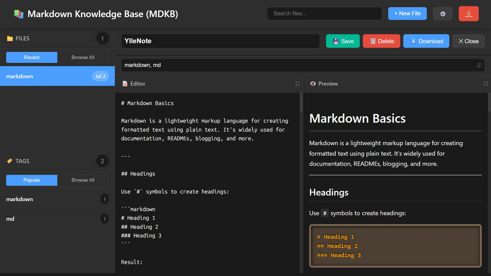

# Markdown Knowledge Base (MDKB)

A modern, open source, self-hosted Markdown knowledge base that puts you in complete control of your data. Organize, search, and tag your notes and documentation with a beautiful, responsive web interface - no vendor lock-in, no monthly fees, no privacy concerns.



## Why Choose MDKB?

### 🔒 **Own Your Data**
- **Complete Privacy**: Your notes never leave your server
- **No Vendor Lock-in**: Export your data anytime in standard Markdown format
- **GDPR Compliant**: Perfect for organizations with strict data requirements

### 💰 **Cost Effective**
- **Zero Subscription Fees**: No monthly costs like commercial alternatives
- **Minimal Infrastructure**: Runs on any basic web server with PHP
- **Scalable**: Handles everything from personal notes to team documentation

### 🛠 **Developer Friendly**
- **Open Source**: MIT license means you can modify, extend, and redistribute
- **Simple Architecture**: Clean PHP codebase that's easy to understand and customize
- **Self-Hosted**: Deploy anywhere - your server, VPS, or even localhost

### 🚀 **Modern Features Without Complexity**
- **Real-time Editing**: Live preview as you type
- **Smart Organization**: Powerful tagging and search capabilities
- **Mobile Ready**: Works perfectly on phones and tablets
- **Fast & Lightweight**: No bloated frameworks or heavy dependencies

## Perfect For

- **Developers**: Technical documentation, code snippets, and project notes
- **Writers**: Research notes, drafts, and reference materials
- **Teams**: Collaborative documentation without expensive enterprise tools
- **Students**: Course notes, research, and study materials
- **Professionals**: Meeting notes, procedures, and knowledge sharing

## Key Features
- Secure login with cookie-based authentication
- Create, edit, and delete Markdown files
- Load existing .md files from your local storage
- Tagging and search for fast organization
- Responsive design (desktop & mobile)
- File uploads with type/size restrictions
- Auto-save and backup support
- Browse and filter by tags or files
- Dark and light themes
- Custom favicon and header icon support

## Quick Start

Get up and running in minutes:

1. **Clone & Setup:**
   ```sh
   git clone https://github.com/yllemo/Markdown-Knowledge-Base.git
   cd Markdown-Knowledge-Base
   ```

2. **Configure (Optional):**
   - Copy `config.php` to `config.custom.php` for custom settings
   - Or use defaults for immediate testing

3. **Launch:**
   - **Local Development**: `php -S localhost:8000`
   - **Web Server**: Upload to your hosting provider
   - **Docker**: `docker run -p 8000:80 -v $(pwd):/var/www/html php:apache`

4. **Access & Setup:**
   - Open `http://localhost:8000` (or your domain)
   - Complete the simple setup wizard
   - Start creating your knowledge base!

## Advanced Installation
For production environments:

1. **Clone the repo:**
   ```sh
   git clone https://github.com/yllemo/Markdown-Knowledge-Base.git
   cd Markdown-Knowledge-Base
   ```
2. **Configure:**
   - Copy `config.php` to `config.custom.php` and edit as needed (password, session timeout, etc)
   - Set up a web server (Apache, Nginx, or PHP built-in server)
3. **Secure:**
   - Enable HTTPS
   - Set proper file permissions
   - Configure regular backups

## Comparison with Alternatives

| Feature | MDKB | Notion | Obsidian | GitBook |
|---------|------|--------|----------|---------|
| **Cost** | Free (Open Source) | High | Medium | Medium |
| **Data Ownership** | ✅ Full | ❌ Vendor | ⚠️ Partial | ❌ Vendor |
| **Privacy** | ✅ Complete | ❌ Limited | ⚠️ Sync only | ❌ Limited |
| **Customization** | ✅ Full access | ❌ Limited | ⚠️ Plugins | ❌ Themes only |
| **Offline Access** | ✅ Always | ❌ Limited | ✅ Yes | ❌ No |
| **Self-Hosted** | ✅ Yes | ❌ No | ❌ No | ❌ No |

## Usage
- Log in with your configured password.
- Create, edit, and tag Markdown notes.
- **Load existing .md files**: Click the "📁 Load" button to import .md files from your local storage
- Use the sidebar or search to find notes.
- Click the Files/Tags headers or stats to browse all.

## Configuration
- All settings are in `config.php` (or override in `config.custom.php`).
- Change password, session timeout, file size/type, and more.

### Customization
- **Favicon**: Upload a custom favicon (JPG, PNG, GIF, SVG, ICO) in Settings → Appearance
- **Header Icon**: Add a custom header icon that appears next to the site title
- **Site Title**: Customize the title displayed in the header and browser tab
- **Theme**: Choose between dark and light themes
- **Editor Settings**: Adjust font size, auto-save interval, and more

## Contributing

We welcome contributions from the community! This project thrives because of developers like you.

**Ways to contribute:**
- 🐛 **Bug Reports**: Found an issue? Open an issue with details
- 💡 **Feature Requests**: Have an idea? We'd love to hear it
- 🔧 **Code Contributions**: Fork, improve, and submit a pull request
- 📚 **Documentation**: Help improve guides and examples
- 🌍 **Translations**: Make MDKB accessible in more languages

**Getting Started:**
1. Fork the repository
2. Create a feature branch (`git checkout -b feature/amazing-feature`)
3. Commit your changes (`git commit -m 'Add amazing feature'`)
4. Push to the branch (`git push origin feature/amazing-feature`)
5. Open a Pull Request

## Community & Support

- **GitHub Issues**: Bug reports and feature requests
- **Discussions**: Questions and community support
- **Wiki**: Additional documentation and examples

Join our growing community of users who believe in data ownership and privacy!

## License

**MIT License** - Use it, modify it, distribute it, even commercially. See [LICENSE](LICENSE) for full details.

**Why MIT?** We believe in true open source - no restrictions, no strings attached. Your knowledge base, your rules.

---

⭐ **Star this project** if you find it useful! It helps others discover MDKB and motivates continued development.